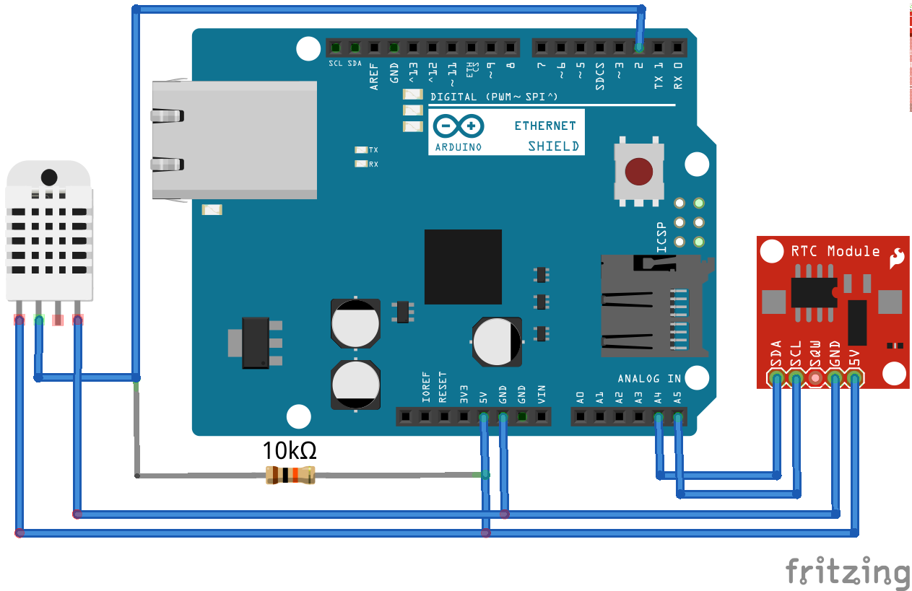

Meteoduino
==========

My personal Arduino-based meteorological station. (OK, it's just an Arduino
with an Ethernet shield and some sensors)

Hardware
--------

* Arduino Uno
* Arduino Ethernet Shield
* DHT22 Temperature/Humidity Sensor
* DS1307 RTC Module

Wiring
------

Software
--------

* Adafruit DHT library - https://github.com/adafruit/DHT-sensor-library
* Bill Greiman's SdFatLib - http://code.google.com/p/sdfatlib/
* JChristensen's Timer library - https://github.com/JChristensen/Timer
* Highstock charts - http://www.highcharts.com/

This is still a work-in-progress. No time for README, must write code!
